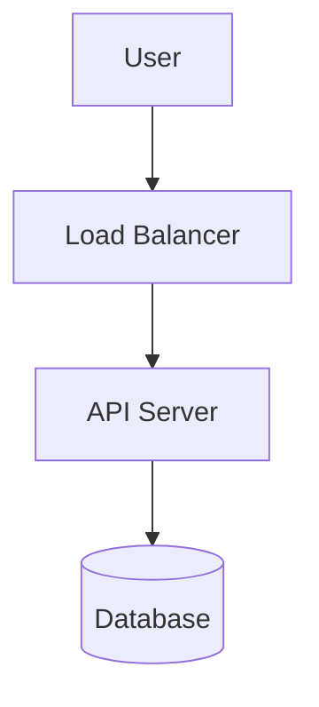

# Quickstart

## Step 1: Open the editor

Navigate to [glyphic.cc/app](https://glyphic.cc/app). The editor opens with an example diagram pre-loaded.

## Step 2: Write a diagram

Clear the editor and paste:



The preview panel on the right updates instantly.

## Step 3: Add an animation

Append this block below your diagram:

```
@animate
  A -> B: duration=1s delay=0
  B -> C: duration=1s delay=0.5s
  C -> D: duration=1s delay=1s
@end
```

Click the play button in the preview panel. Edges animate in sequence.

## Step 4: Export

Click **Export** in the toolbar and choose **GIF** to download an animated export.

| Export format | Use case |
|---|---|
| SVG | Scalable, embeddable in docs |
| PNG | Slide decks, PR comments |
| GIF | Animated, universal support |
| WebM | High-quality video, Notion embeds |

Lorem ipsum dolor sit amet, consectetur adipiscing elit.
