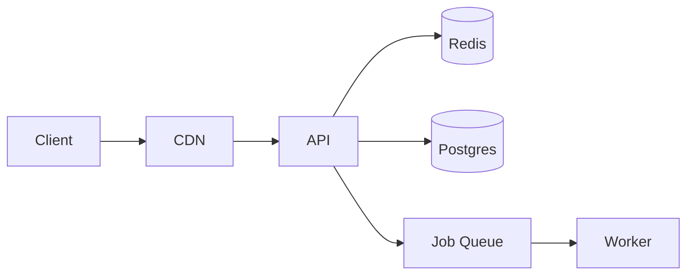

# Your First Project

Lorem ipsum dolor sit amet, consectetur adipiscing elit. In this guide we'll build a realistic system architecture diagram, animate it, and share a view-only link.

## What we're building

A three-tier web application diagram with animated request flow.

## 1. Define the architecture



## 2. Style the nodes

```
@style
  Client: fill=#6366F1 color=#fff
  CDN: fill=#E0E7FF
  DB: fill=#FEF3C7
@end
```

## 3. Animate the request flow

```
@animate
  Client -> CDN: duration=0.8s
  CDN -> API: duration=0.8s delay=0.7s
  API -> Cache: duration=0.6s delay=1.4s
@end
```

## 4. Share it

Click **Share → View Only**. Copy the link and send it to your team. They see the animated diagram — not the source.

| Step | Result |
|---|---|
| Share → View Only | Generates a `/view/:id` URL |
| Share → Editable | Generates an `/edit/:id` URL |
| Export → GIF | Downloads `diagram.gif` |

Lorem ipsum dolor sit amet, consectetur adipiscing elit. Sed do eiusmod tempor.
